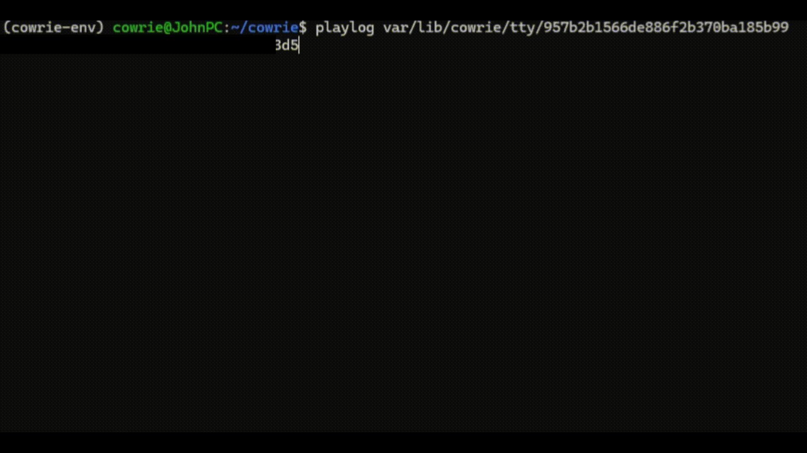

# 🛡️ SSH Honeypot - Threat Intelligence Lab

---

## 📖 O Projekcie

SSH Honeypot to zaawansowane środowisko bezpieczeństwa oparte na narzędziu **Cowrie**. Projekt ma na celu stworzenie kontrolowanej pułapki (Honeypot), która udaje autentyczny serwer SSH, aby przyciągać, monitorować i analizować techniki stosowane przez hakerów oraz boty w internecie.

---

### 1. 🔍 Przechwytywanie Ataków

Honeypot działa jako "fałszywy cel", zbierając dane o każdej próbie interakcji.

- **Baza Poświadczeń**: System loguje każdą kombinację loginu i hasła wykorzystaną podczas prób logowania brute-force.
- **Logowanie w Czasie Rzeczywistym**: Pełny zapis zdarzeń w formacie JSON, gotowy do integracji z systemami SIEM (np. Wazuh).
- **Emulacja Systemu**: Udaje autentyczne środowisko Debian, co pozwala na dłuższą obserwację działań intruza.

### 2. 🎬 Odtwarzanie Sesji (TTY Forensics)

*Odtwarzanie sesji atakującego w czasie rzeczywistym przy użyciu `playlog`*

- **System Playlog**: Możliwość odtworzenia pełnej sesji terminalowej.
- **Analiza Behawioralna**: Badanie, jakie pliki są modyfikowane i jakich narzędzi używa napastnik po uzyskaniu dostępu.

### 3. 📥 Malware Capture

Bezpieczne gromadzenie narzędzi hakerskich.

- **Automatyczny Download**: Jeśli atakujący spróbuje pobrać plik (np. przez `wget` lub `curl`), system przechwyci go i zapisze w odizolowanym folderze do późniejszej analizy wirusologicznej.
- **Bezpieczne Składowanie**: Wszystkie pobrane skrypty i pliki binarne są odseparowane od głównego systemu operacyjnego.

### 4. 🧱 Odizolowane Środowisko

- **Użytkownik bez Uprawnień**: Procesy honeypota działają na dedykowanym koncie bez dostępu do komend `sudo`.

---